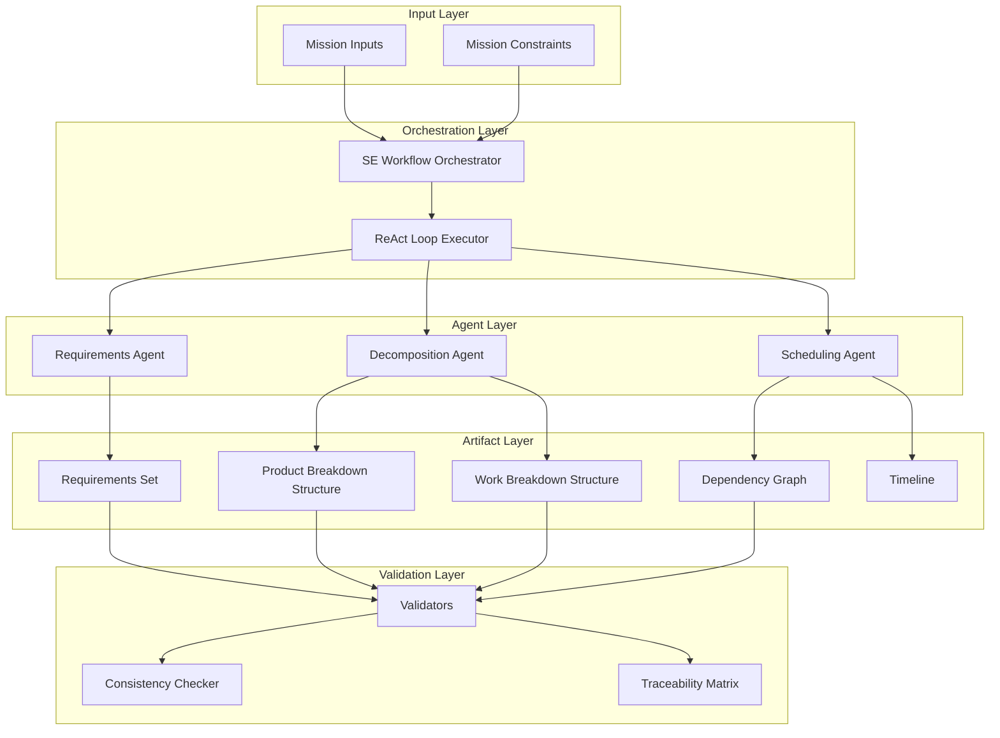

# Astraeus Apertura - System Architecture

## Overview

Astraeus Apertura is an agentic systems engineering framework that automates the generation and validation of SE artifacts for satellite mission planning. The framework implements the ReAct (Reason + Act) paradigm with specialized agents for different SE tasks.

## Architecture Diagram



## Component Descriptions

### Input Layer

#### Mission Inputs
- Mission objectives and constraints
- Launch targets and timelines
- Payload requirements
- Environmental constraints

### Orchestration Layer

#### SE Workflow Orchestrator (`orchestration/workflow.py`)
- Coordinates the full pipeline execution
- Manages stage transitions
- Handles artifact persistence
- Aggregates results

#### ReAct Loop Executor (`orchestration/react_loop.py`)
- Implements the Thought → Action → Observation loop
- Provides trace logging for auditability
- Supports callbacks for monitoring
- Handles termination conditions

### Agent Layer

Each agent follows the ReAct pattern:
1. **Reason** about current state
2. **Select Action** based on reasoning
3. **Execute Action** using tools
4. **Observe Results** and update state

#### Requirements Agent (`agents/requirements_agent.py`)
- **Purpose**: Extract and classify requirements from mission inputs
- **Tools**:
  - `extract_requirements`: Parse mission input data
  - `classify_requirement`: Categorize by type
  - `validate_requirement_set`: Check completeness
  - `generate_derived_requirements`: Create constraint-derived requirements

#### Decomposition Agent (`agents/decomposition_agent.py`)
- **Purpose**: Generate PBS and WBS from requirements
- **Tools**:
  - `initialize_pbs`: Create PBS structure
  - `create_pbs_node`: Add individual nodes
  - `allocate_requirements`: Map requirements to PBS
  - `derive_wbs_from_pbs`: Generate work packages

#### Scheduling Agent (`agents/scheduling_agent.py`)
- **Purpose**: Build dependency graphs and timelines
- **Tools**:
  - `initialize_dependency_graph`: Create from WBS
  - `add_dependency`: Add relationships
  - `compute_critical_path`: Find critical path
  - `generate_timeline`: Create schedule

### Artifact Layer

#### Requirements Set (`artifacts/requirements.py`)
- Pydantic models for requirement items
- Category classification (functional, performance, interface, etc.)
- Verification method tracking
- Parent-child relationships for derived requirements

#### Product Breakdown Structure (`artifacts/pbs.py`)
- Hierarchical tree structure
- Node attributes (mass, power, criticality)
- Traversal methods (preorder, postorder)
- Requirement allocation tracking

#### Work Breakdown Structure (`artifacts/wbs.py`)
- Work package definitions
- PBS-to-WBS mapping
- Effort and duration estimates
- Dependency tracking

#### Dependency Graph (`artifacts/dependencies.py`)
- NetworkX-based directed graph
- Cycle detection
- Critical path analysis
- Topological sorting

#### Timeline (`artifacts/timeline.py`)
- Scheduled tasks with dates
- Working day calculations
- Resource conflict detection
- Gantt chart export

### Validation Layer

#### Validators (`tools/validation.py`)
- Requirements completeness checking
- PBS coverage validation
- WBS derivation verification

#### Consistency Checker (`tools/consistency_checker.py`)
- Cross-artifact reference validation
- Orphaned element detection
- Hierarchy integrity checks

#### Traceability Matrix
- Requirements → PBS → WBS mapping
- Completeness tracking
- Gap identification

## Data Flow

```
Mission Inputs
      ↓
┌─────────────────┐
│ Requirements    │ ← RequirementsAgent
│ Agent           │
└────────┬────────┘
         ↓
   RequirementsSet
         ↓
┌─────────────────┐
│ Decomposition   │ ← DecompositionAgent
│ Agent           │
└────────┬────────┘
         ↓
    PBS + WBS
         ↓
┌─────────────────┐
│ Scheduling      │ ← SchedulingAgent
│ Agent           │
└────────┬────────┘
         ↓
Dependencies + Timeline
         ↓
   Validation & Export
```

## Key Design Decisions

### ReAct Pattern
- Explicit reasoning traces for auditability
- Tool-based actions for artifact manipulation
- Iterative refinement with observation feedback

### Pydantic Models
- Strong typing and validation
- JSON serialization/deserialization
- Automatic schema generation

### NetworkX for Dependencies
- Mature graph algorithms
- Cycle detection and critical path
- Topological sorting

### Separation of Concerns
- Agents focus on reasoning and action selection
- Tools handle artifact operations
- Validators ensure consistency

## Extension Points

1. **Custom Agents**: Extend `BaseAgent` with domain-specific reasoning
2. **New Tools**: Add tools to agent toolkits for new capabilities
3. **Artifact Types**: Create new Pydantic models for additional SE artifacts
4. **Validators**: Add custom validation rules for specific domains

## Future Architecture (AWS Deployment)

```
┌─────────────────────────────────────────────────────────────────┐
│                        AWS Deployment                           │
├─────────────────────────────────────────────────────────────────┤
│  Amazon Bedrock (LLM + Agents)                                  │
│       ↓                                                         │
│  AWS Lambda (Tools / Custom Orchestration)                      │
│       ↓                                                         │
│  AWS Step Functions (Workflow Orchestration)                    │
│       ↓                                                         │
│  Amazon S3 / RDS (Artifact Storage)                             │
│       ↓                                                         │
│  Amazon CloudWatch (Logging + Observability)                    │
└─────────────────────────────────────────────────────────────────┘
```
